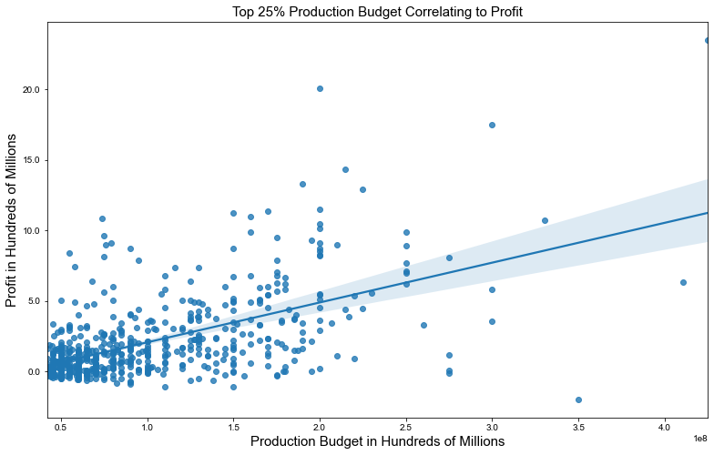
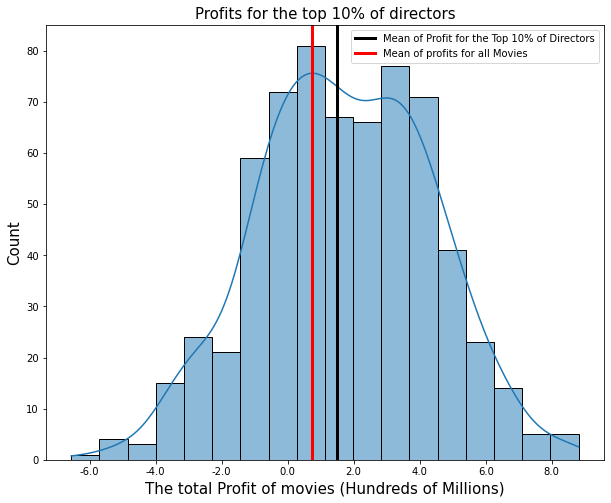
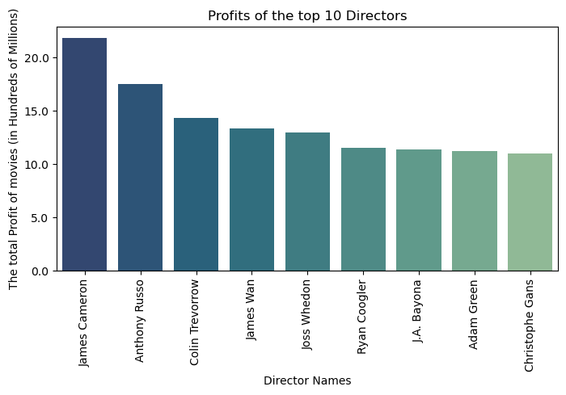
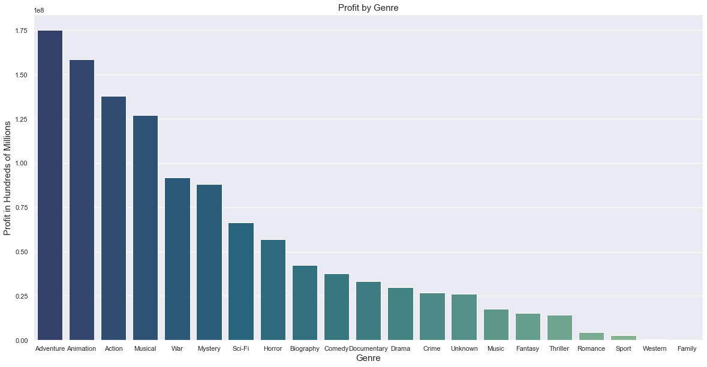
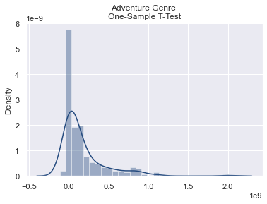
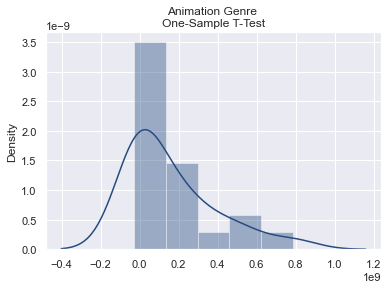

# group-5-0206
## Overview

## Links to Presentation and Notebooks
[Main Notebook](./CapstoneNotebook.ipynb)  

[Presentation](./Presentation.pdf) 

Individual Notebooks

[Allen's Notebook](./notebooks/allen/allen.ipynb)  

[Cole's Notebook](./notebooks/cole/cole.ipynb) 

[Joshua's Notebook](./notebooks/joshua/joshua.ipynb) 

[Saketh's Notebook](./notebooks/saketh/Saketh_Main.ipynb) 

[Zach's Notebook](./notebooks/zach-final.ipynb) 

## Navigating Instructions 
The main deliverables for this project are located in the main folder of the repository. To access the data used for this project click on the data folder and then the zipped data folder, all of the data provided for this project is located in this folder. To access the individual notebooks for each member you can either click on one of the links directly above or click on the notebooks folder and then choose the folder of the specific members notebook you want to access. Finally to see the .png files for the data visualizations used in this project click on the visualizations folder

## Data Science Steps Taken 
1: Defined a business Problem  
2: Found useful data  
3: Cleaned and processed data  
4: Analyzed and modeled the data  
5: Determine recommendations and next steps based on analysis  
    
## Packages Used 
sqlite3   
pandas  
seaborn  
matplotlib.pyplot  
numpy  
scipy: stats  
matplotlib.ticker: FuncFormatter  

## Business Understanding 
Stakeholders: Computing vision - An innovative and dynamic movie production company dedicated to creating their first film that showcases cutting-edge visual effects and makes a mark on the cinematic storytelling industry.

Business Problem: Provide actionable insights that the head of Computing Vision's new movie studio can use to help decide what type of films to create. The insights were determined by data aggregation and alaysis techniques as well as statistical analysis'
    
Key Business Questions: What metric's do Computing Vision want to track and use to gauge success of the movie studio? Are there any predefined limitations on budget, writers/directors, etc. that could impact the recommendations given?

## Data Understanding 
We retrieved our data from tn.movie_budgets.csvfile and the IMDB SQL database, which served as the primary sources of our analysis. The   tn.movie_budgets.csv dataset provided insight into the production budget of each movie as well as the gross domestic revenue and the total    worldwide revenue of the movie. The IMDB dataset provided insight into categorical data about the movies including writers, directors, genre, runtime, ratings, etc. These datasets also both include the name of the movie, which allows us to join the datasets together so that we were able to analyze and make recommendations
    
## Data Analysis
________________________
    
## Comparing Production Budget vs. Profit

## Comparing Top 10% Directors Profit vs All Profit

## Example of Top 10 Directors

## Statistical Inference 
________________________________

## Comparing Profits by Genre 

## T-Test Graph of Adventure Genre

## T-Test Graph of Animation Genre

## Results:
Adventure: P-Value: 6.24 * 10-7 with a sample size of 200

Animation: P-Value: 0.10 with a sample size of 21

## Intrepretation of Results:
Tested adventure and animation at a 95% confidence interval
Relationship between adventure genre and profit is statistically significant
Can not confirm that relationship between the animation genre and profit is statistically significant

## Recommendations

The analysis of production budget vs profits showed that Computing Vision should allocate a production budget that maximizes the chance of profitability and maintains a reasonable financial risk to Computing Vision

The analysis of directors vs profit showed that computing vision should hire one of the top 10% of directors to direct their movie 

The statistical analysis showed that computing vision should make an adventure movie. 

